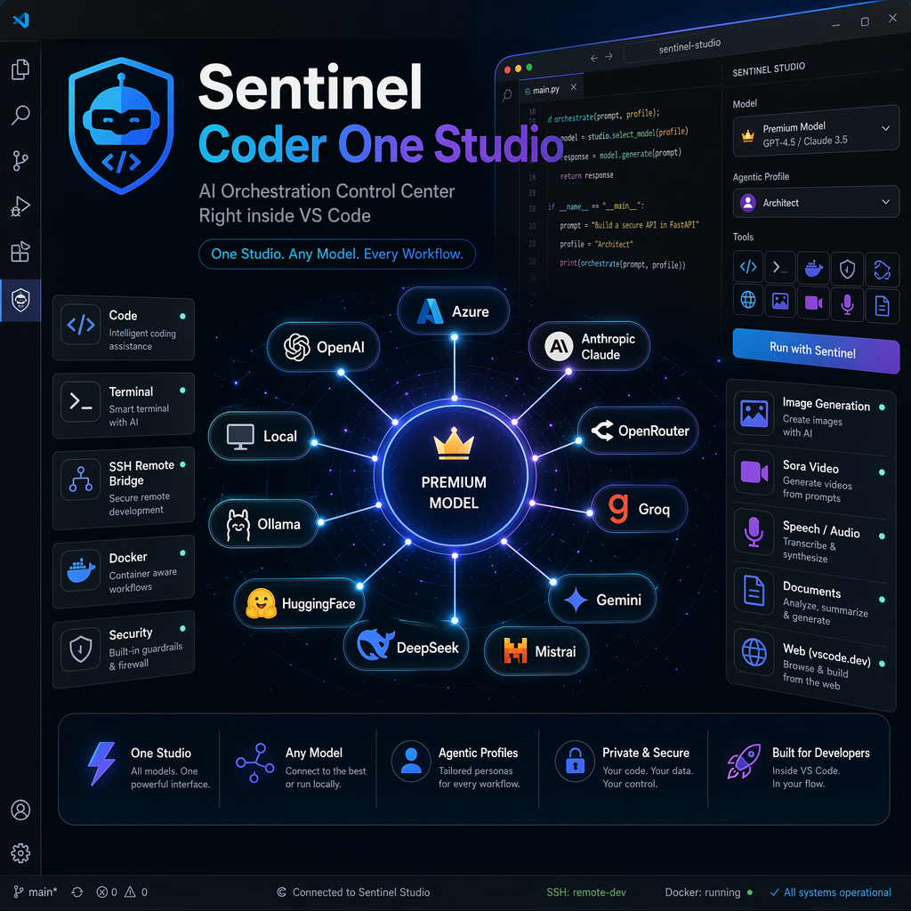

<div align="center">

# Sentinel Coder One Studio

### Autonomous AI coding + Agentic Profiles + Media & Document Studio for Visual Studio Code

**Multi-provider chat | Categorized live model selector | Single-model full-capability mode | Opt-in Agentic orchestration | Azure/OpenAI/Anthropic/Groq/OpenRouter/Ollama and OpenAI-compatible providers | Sora video | Image/audio/document Studio | VS Code Web + Remote Tool Bridge**

Built by [QubitPage Research](https://github.com/qubitpage) | MIT licensed

[GitHub repository](https://github.com/qubitpage/sentinel-coder-vscode) | [Contributing guide](https://github.com/qubitpage/sentinel-coder-vscode/blob/main/CONTRIBUTING.md) | [Issues and feature requests](https://github.com/qubitpage/sentinel-coder-vscode/issues)

</div>

---

## What is Sentinel Coder One Studio?

Sentinel Coder One Studio is a VS Code AI agent that can help you plan, code, edit, test, package, document, inspect files, generate media, and orchestrate multiple AI models when you explicitly choose an Agentic Profile.

It is designed around two safe defaults:

1. **Single-model mode uses the selected model directly.** If you choose GPT-4.1, GPT-5.5, Grok, OpenRouter, Groq, Ollama, or any other configured model from the normal dropdown, Sentinel lets that model work to its full detected capability.
2. **Agentic orchestration is opt-in.** Worker/reviewer routing activates only when you intentionally choose a real `Agentic:` profile.

---

## New in 3.16.22

- **Fixed post-3.16.10 chat dropdown visibility regression**: the top chat selector now keeps showing Auto routing, Agentic profile modes, most-used choices, and cached/provider fallback models even when a live provider refresh temporarily returns no normal models.
- **Agentic modes always remain selectable**: profile updates immediately refresh the chat selector, so built-in and custom Agentic profiles are not hidden by provider catalog outages.
- **Regression protected**: the model selector test now blocks any future build that replaces the selector with a dead "No configured models" placeholder or removes Auto/Agentic visibility.

## New in 3.16.21

- **Studio video generation documentation upgrade**: the Marketplace README now explains Azure Sora 2 video generation, MP4 output, prompt structure, size/duration options, audio expectations, smoke testing, and troubleshooting.
- **MAI + GPT image workflow documentation**: Studio docs now distinguish `azure:gpt-image-2` and `azure:MAI-Image-2e`, how outputs are saved, and how generated images are previewed/reused.
- **Studio file manager polish**: the Studio view now exposes create, duplicate, rename, delete, open, reveal, save, version, comment, and AI-action workflows for generated/workspace assets.
- **Video/audio preview polish**: Sora MP4 and audio previews use native VS Code webview media controls with sound/volume guidance instead of treating Studio as image-only.
- **Media capability discovery correction**: `discoverMediaModels` reports Sora 2 as a wired/testable Azure video model while still warning that availability depends on the configured Azure account, region, quota, and content policy.
- **MCP local server startup hardening**: built-in filesystem and memory MCP servers now resolve `npx.cmd` correctly on Windows/Desktop and allow longer first-run startup when `npx -y` downloads MCP packages.
- **RAG fallback memory**: if the optional external `rag_server.py` vector service is not running, `ingestRAG` saves to `.sentinel/rag/local-memory.jsonl` and `queryRAG` searches that local fallback instead of failing with only “server not available.”

## New in 3.16.20

- **Fixed Auto-only chat model selector regression**: the chat dropdown now keeps showing configured/discovered provider models instead of collapsing to only `Auto` when one live provider catalog request fails or returns temporarily incomplete metadata.
- **Fixed model-list JavaScript refresh error**: removed a stale selector helper call that could stop the categorized model picker after the backend sent refreshed models.
- **Safer provider discovery fallback**: provider catalog/metadata outages are isolated per provider, and unexpected refresh failures reuse cached/provider/profile model data instead of sending an Auto-only list.
- **Regression tested**: the model selector test now blocks undefined selector helpers and Auto-only replacement behavior before packaging.

## New in 3.16.19

- **Marketplace refresh release**: republishes the verified 3.16.18 ASCII-safe landing page, canonical docs cleanup, and enterprise release-gate updates under a fresh patch version so Microsoft Marketplace CDN/index caches refresh correctly for Desktop and Web users.
- **No feature rollback**: preserves all verified runtime features from 3.16.18, 3.16.17, and 3.16.16, including multi-session terminal pool, memory guardrails, Remote Workspace command support, resilient Agentic fallback, VS Code Web compatibility, and strict package hygiene.
- **Enterprise documentation remains canonical**: README, CHANGELOG, provider setup, security/release checklist, hard critique roadmap, contribution, donation/community, whitepaper, and pitch deck links stay consolidated and encoding-safe.

## New in 3.16.18

- **ASCII-safe Marketplace/GitHub landing page**: rebuilt the public README/CHANGELOG text without mojibake-prone separators so feature bullets render cleanly on GitHub and the Visual Studio Marketplace.
- **Canonical documentation hub**: removed duplicate historical docs and kept one clear path for providers, security/release, donation/community, enterprise setup, whitepaper, pitch deck, VS Code Web, Remote Workspace, and Agentic strategy.
- **No feature rollback**: preserves the verified 3.16.17/3.16.16 runtime features: multi-session terminal pool, memory guardrails, Remote Workspace command support, Agentic fallback hardening, web package compatibility, and enterprise release gates.

## New in 3.16.17

- **Marketplace refresh repack**: republishes the verified 3.16.16 stability work under a fresh Marketplace version so both Desktop and VS Code Web channels expose the latest multi-session terminal pool, memory guardrails, Remote Workspace tooling, Agentic resilience, and enterprise documentation updates.
- **No feature rollback**: 3.16.17 contains the same tested 3.16.16 multi-session/resource-guard release plus the full 3.16.15 Remote Explorer workflow and 3.16.14 Agentic fallback/documentation pack.

## New in 3.16.16

- **Multi-session terminal pool**: `runCommand` and `remoteWorkspaceCommand` now support optional named `sessionId` values, so parallel Sentinel chats, builds, tests, dev servers, and remote-server fixes no longer get stuck behind one global terminal session.
- **Resource and memory guardrails**: Sentinel limits terminal fan-out with `sentinelCoder.terminalMaxSessions`, refuses new sessions when free memory falls below `sentinelCoder.terminalMinFreeMemoryMb`, and cleans idle non-default sessions after `sentinelCoder.terminalIdleCleanupSeconds`.
- **Remote-safe parallel work**: when connected through VS Code Remote SSH, Dev Containers, WSL, Codespaces, or Tunnels, use separate `sessionId` values such as `server-build`, `server-tests`, and `server-logs` to work on the already-authenticated remote host without re-entering SSH keys.

## New in 3.16.15

- **Remote Explorer server-control tool**: added `remoteWorkspaceCommand`, a first-class tool for VS Code Remote SSH, Dev Containers, WSL, Codespaces, and Tunnels. When Sentinel is installed/running on the remote workspace extension host, it can run approved commands on that already-authenticated server without asking again for SSH keys or private-key paths.
- **Safer SSH workflow**: use `remoteWorkspaceCommand` for the server you are already connected to in VS Code Remote Explorer; use `sshCommand` only for a separate external SSH target. Never paste private keys into chat.
- **Marketplace docs update**: documented the difference between Desktop local terminal, VS Code Remote workspace host execution, pure browser vscode.dev limitations, and the optional HTTPS Remote Tool Bridge.

## New in 3.16.14

- **Resilient Agentic worker fallback**: if a free/cheap worker is rate-limited, throttled, overloaded, temporarily unavailable, or returns a provider 429/5xx-style error, Sentinel cools that worker down, tries another configured worker/reviewer when possible, and continues with a warning instead of collapsing the whole turn.
- **New multi-provider model article**: added a Marketplace-visible guide covering live provider catalogs, paid vs free/free-tier model strategy, OpenRouter access to latest Claude/Fable/Opus-style models, Agentic Profiles, Studio media generation, desktop tools, VS Code Web, and enterprise safeguards.
- **New presentation hero image**: added a generated provider-orchestration presentation image for the Marketplace/GitHub documentation pack.



- **Security-hardened webviews**: Chat sidebar and Studio renderers now avoid scattered raw HTML assignment for user/workspace data; dynamic cards/lists are rendered through DOM-safe builders or centralized sanitized fragments.
- **Publish-ready Web compatibility verification**: desktop and web VSIX builds are verified with the web manifest checker and archive hygiene checks before Marketplace upload.
- **Cleaner packaged artifacts**: runtime packages exclude source, tests, scripts, scratch folders, PowerShell helpers, and inspection artifacts while keeping public docs available in Marketplace.

- **Categorized live model selector**: the chat picker now shows `Agentic Modes` first, then `Most used models and modes`, then every configured/discovered model grouped by provider and by Local / Free / Free-tier / Subscription / Paid / Unknown price categories.
- **Provider-neutral Agentic presets**: built-in editable profiles now cover Azure, OpenAI, Claude/Anthropic, OpenRouter, Groq, local Ollama/private coding, cost-saving swarms, novelty labs, and multi-provider elite ensembles.
- **Adaptive profile templates**: preset model IDs are role templates, not hard blockers. Sentinel uses the live provider/model dropdown and preserves user edits; if a listed model is unavailable, choose the nearest configured model for that role.
- **Deterministic Agentic orchestration**: when you explicitly select an `Agentic:` profile and the task is substantial, Sentinel runs profile worker/reviewer preflight and injects those findings into the main orchestrator turn.
- **Single models still work at maximum potential**: choosing a normal model keeps a direct single-model flow with the model's detected context/output capability; orchestration only activates for selected Agentic profiles.
- **Live dropdown Agentic profile editor**: Settings -> Agentic uses provider/model dropdowns for the main orchestrator and multi-select live model lists for adding worker and reviewer agents under each profile.
- **Selection preservation during provider refresh**: if Azure/Groq/OpenRouter/OpenAI-compatible provider discovery updates while the profile editor is open, selected agents are preserved instead of disappearing.
- **Visible agent pools and usage telemetry**: profile cards show main model, worker agents, default worker, reviewer agents, policy, premium-worker setting, max parallel count, and turn footers show orchestrator/sub-agent usage.
- **Add follow-up while running**: the Send button becomes a highlighted **Add follow-up** action during active runs so you can queue extra instructions without stopping the agent.
- **Live provider catalogs and context metadata**: Azure/OpenAI-compatible, OpenRouter, Groq, Anthropic/OpenAI-style, Ollama, and other configured catalogs can refresh model lists, context windows, supported parameters, pricing notes, and capability badges where APIs expose them.
- **VS Code Web / vscode.dev compatibility workflow**: browser entry point, web workspace capability declarations, web VSIX packaging, and Remote Tool Bridge settings are included.
- **Expanded public documentation**: see the [Documentation Hub](docs/README.md), [Provider and Settings Guide](docs/PROVIDER_AND_SETTINGS_GUIDE.md), [Enterprise Setup and Operations Guide](docs/ENTERPRISE_SETUP_AND_OPERATIONS.md), [End-to-End User Guide](docs/END_TO_END_USER_GUIDE.md), [Agentic Profile Strategy](docs/AGENTIC_PROFILE_STRATEGY.md), [Whitepaper](docs/WHITEPAPER.md), [Pitch Deck](docs/PITCH_DECK.md), [Browser Pitch Deck](docs/pitchdeck.html), [Enterprise Code Quality Audit](docs/ENTERPRISE_CODE_QUALITY_AUDIT.md), and [Security and Release Checklist](docs/SECURITY_AND_RELEASE_CHECKLIST.md).
- **Open-source sustainability**: added public support/donation documentation with PayPal donation link and QR code so users who benefit from the project can help keep it frequently updated.

---

## Documentation and guides

- [Documentation Hub](docs/README.md)
- [Provider and Settings Guide](docs/PROVIDER_AND_SETTINGS_GUIDE.md)
- [Remote Workspace Tools: VS Code Remote SSH, Containers, WSL, Codespaces, and Tunnels without re-entering SSH keys](docs/REMOTE_WORKSPACE_TOOLS.md)
- [Multi-Provider Model Article: live catalogs, OpenRouter Claude/Fable/Opus-style models, free/paid strategy, Agentic Profiles, Studio, and Web](docs/MULTI_PROVIDER_MODEL_ARTICLE.md)
- [Enterprise Setup and Operations Guide](docs/ENTERPRISE_SETUP_AND_OPERATIONS.md)
- [End-to-End User Guide](docs/END_TO_END_USER_GUIDE.md)
- [Agentic Profile Strategy](docs/AGENTIC_PROFILE_STRATEGY.md)
- [Whitepaper](docs/WHITEPAPER.md)
- [Pitch Deck](docs/PITCH_DECK.md)
- [Browser Pitch Deck](docs/pitchdeck.html)
- [Enterprise Code Quality Audit](docs/ENTERPRISE_CODE_QUALITY_AUDIT.md)
- [Security and Release Checklist](docs/SECURITY_AND_RELEASE_CHECKLIST.md)
- [Donation and Community Guide](docs/DONATION_AND_COMMUNITY.md)

---

## Core features

### Coding agent

- Ask, Plan, and Agent modes.
- Create, read, edit, append, and delete files.
- Search files/text and use natural-language codebase search.
- Read active file, selection, diagnostics, open tabs, and workspace info.
- Run terminal commands with persistent shell state.
- Build/test/package real projects and report actual command results.
- Serve local HTML files and open browser previews.
- Git status/diff/log/commit/push helpers.
- Docker and SSH tools in VS Code Desktop.
- `remoteWorkspaceCommand` for VS Code Remote Explorer sessions: run approved commands on the already-connected Remote SSH / Dev Container / WSL / Codespaces / Tunnel workspace host without re-entering SSH keys.
- HTTP requests and web search.
- RAG ingest/query for project knowledge.
- Targeted firewall/security scan for secrets, unsafe HTML, injection risks, destructive commands, and debug code.

### Multi-provider model support

Configured providers can include:

- Azure OpenAI / Azure AI Foundry.
- OpenAI-compatible providers.
- OpenRouter.
- Groq.
- Anthropic.
- Mistral.
- DeepSeek.
- Together.
- Vultr.
- HuggingFace / Featherless.
- Moonshot / Kimi.
- Local Ollama.

Where available, Sentinel refreshes model dropdowns from live provider APIs and updates context/output metadata automatically.

### Community and contributions

Sentinel Coder One Studio is published with a public contribution path:

- Repository: [github.com/qubitpage/sentinel-coder-vscode](https://github.com/qubitpage/sentinel-coder-vscode)
- Contribution guide: [CONTRIBUTING.md](https://github.com/qubitpage/sentinel-coder-vscode/blob/main/CONTRIBUTING.md)
- Issues and feature requests: [GitHub Issues](https://github.com/qubitpage/sentinel-coder-vscode/issues)

Use the repository for provider requests, Web compatibility reports, Agentic Profile templates, Studio/media workflow improvements, docs fixes, and security-hardening suggestions. Do not post API keys or private customer data in public issues.

### Donate / support open-source development

Sentinel Coder One Studio is open source. If you like the project and want to contribute to keeping it frequently updated, any amount is useful to sustain development, testing, provider updates, security hardening, and documentation.

- Donate via PayPal: [paypal.com/donate/?hosted_button_id=97VNNYCB3HWMS](https://www.paypal.com/donate/?hosted_button_id=97VNNYCB3HWMS)
- Donation QR: [docs/assets/paypal-donation-qr.png](docs/assets/paypal-donation-qr.png)
- Donation details: [docs/DONATION_AND_COMMUNITY.md](docs/DONATION_AND_COMMUNITY.md)

The project remains open source; donations help keep it maintained and available to the community.


### Agentic Profiles

Agentic Profiles let you define opt-in orchestration from live model selectors:

- Main/orchestrator model from the configured provider/model dropdown.
- Worker agent models via multi-select dropdowns populated from Azure, Groq, OpenRouter, OpenAI-compatible providers, Ollama, and other configured catalogs.
- Reviewer agent models via multi-select dropdowns.
- Default worker model chosen from selected workers plus the full live model registry.
- Cost policy.
- Maximum parallel agents.
- Premium-worker and cheap/free fallback policy.
- Profile-specific instructions.

When a real `Agentic:` profile is selected in Agent mode, Sentinel runs deterministic worker/reviewer preflight for substantial tasks and shows the orchestrator plus sub-agent models in the turn footer. Normal model selections remain single-model and do not auto-orchestrate.

Recommended cost-smart pattern:

- Use a strong daily model such as GPT-4.1, Claude Sonnet, GPT-4.1-mini, Groq OSS 120B, or a local coding model as the orchestrator depending on your provider keys and budget.
- Use a different strong model/provider for adversarial critique and security review to avoid same-model blind spots.
- Use cheaper/free workers for low-risk drafts, code reading, extraction, test ideas, documentation, and brainstorming.
- Reserve GPT-5.5, Claude Opus/Sonnet, GPT-5-class, or other frontier paid models for final review, architecture, security, finance, and hard unresolved decisions.

### Predefined adaptive Agentic profiles

The extension ships editable standard templates so a new user gets sensible orchestration no matter which provider keys they have. These are **adaptive templates**: they appear as built-in profiles, but the profile editor uses live dropdowns from your configured provider catalogs, so you can swap unavailable model IDs for the closest live model.

| Built-in profile | Best when | Default strategy |
| --- | --- | --- |
| Standard: Single Model Full Capability | You selected one normal model | No orchestration; use the selected model directly with its discovered context/output/tool limits. |
| FREE: Multi-Provider Coding Council | You want to test Agentic orchestration with no paid escalation | Uses discovered free/free-tier/local models across OpenRouter, Groq, Gemini/free-tier gateways, and Ollama; main model must verify because free models can be rate-limited or inconsistent. |
| FREE: OpenRouter Coding Swarm | You have an OpenRouter key and want free-only agents | Uses only OpenRouter `:free` or free-priced models such as Qwen/DeepSeek/Kimi/Gemini free entries from the live catalog; paid review is blocked unless you edit/switch profiles. |
| FREE: Groq Fast OSS | You want very fast free-tier/low-cost OSS drafts | Groq OSS models fan out on code reading, docs, tests, and alternative patches; final owner runs strict verification. |
| FREE: Gemini / Google Free-Tier Research | You want free-tier research/planning support | Gemini/Flash-style free models handle research, summaries, UI copy, and plan alternatives, paired with a coding-focused free model when configured. |
| FREE: Local Ollama Private | You want privacy and zero API spend | Local Ollama models lead/draft/review with low parallelism; compile/tests/firewall scans are mandatory because small local models can miss subtle bugs. |
| Adaptive: Best Available From Your Keys | You have one or mixed provider keys and want a sane automatic default | Resolves roles from live configured/discovered models and avoids hard failures when a template model is unavailable. |
| Azure Cost-Smart Production | You have Azure credits but want lower burn | GPT-4.1 owns normal coding, Grok/GPT-4.1 challenge and implement, GPT-5.5 is reserved for final hard review, security, architecture, and risky decisions. |
| Azure Frontier Architect | Correctness beats cost | GPT-5.5 leads hard architecture/high-risk code; GPT-4.1/Grok workers produce alternatives; GPT-5.5 judges final output. |
| OpenAI Balanced Coding | User has OpenAI API keys | GPT-4.1/modern GPT coding model leads; mini/router-class models draft docs/tests/boilerplate; stronger GPT reasoning reviewer validates. |
| Anthropic Claude Code Quality | User has Anthropic or Claude via gateway | Sonnet-class main coder, Haiku-class low-risk workers, Opus/Sonnet reviewer for maintainability and hidden edge cases. |
| OpenRouter Balanced Coding | User has one OpenRouter key and wants many vendors | Best configured Claude/Qwen/Kimi/DeepSeek coding model leads; free models draft; stronger paid model reviews when available. |
| Groq Fast OSS Swarm | User wants fast parallel low-cost work | Groq OSS workers fan out for investigation, tests, docs, and drafts; final owner verifies and escalates if risk is high. |
| Local/Private Ollama | User wants privacy or zero API spend | Local models lead/draft/review with fewer parallel agents; cloud reviewers are added only if the user edits the profile intentionally. |
| Multi-Provider Frontier Council | User has multiple API keys | Azure/OpenAI/Claude/OpenRouter/Groq each get distinct roles; main model synthesizes and verifies instead of voting blindly. |
| Open-Compatible Coding Mix | User has Mistral, DeepSeek, Together, Vultr, Moonshot/Kimi, Featherless, or custom OpenAI-compatible keys | Live dropdown replaces placeholder IDs with discovered coding/reasoning models; cheap workers handle extraction/docs and stronger models review. |

These profiles follow production agent patterns from OpenAI-style routines/handoffs and Anthropic-style prompt chaining, routing, parallelization, orchestrator-worker, and evaluator-optimizer workflows. The main model remains accountable: it must inspect worker output, apply the final patch with tools, run diagnostics/build/tests, and report the actual evidence.

### Media & Document Studio

The Studio view is a workspace asset manager, not only an image gallery. It lets you browse, preview, inspect, edit, version, rename, duplicate, delete, and reuse generated or workspace assets from one VS Code panel.

Supported workflows include:

- **Azure Sora 2 video generation** through `generateVideo` using `azure:sora-2`, saved as MP4 under `.sentinel/generated/videos/`.
- **Sora storyboard planning** with generated JSON storyboards for shot-by-shot prompts, duration, aspect ratio, target platform, continuation notes, quality defaults, and negative prompts.
- **Video preview with sound controls** using native VS Code webview media controls. If the MP4 contains an audio track, unmute/adjust volume in the player. If the model returns silent video, generate narration with Azure Speech and combine externally or ask Sentinel to prepare a post-production plan.
- **Image generation** through `generateImage` using tested Azure deployments `azure:gpt-image-2` and `azure:MAI-Image-2e`, saved under `.sentinel/generated/images/` and previewed in Studio.
- **Azure Speech audio generation** for voiceovers, narration, launch clips, product demos, and accessibility drafts.
- **Speechmatics transcription** for generated or imported audio/video assets.
- **PDF/Office/image/audio/video inspection** where local tooling is available.
- **DOCX/XLSX/PPTX generation** for briefs, reports, spreadsheets, and pitch material.
- **Full generated-file management**: create, open, reveal in OS, save editable text/data, duplicate, rename, delete with version snapshot where possible, restore versions, and add review comments.
- **AI actions from assets**: send selected text/file context back to Sentinel Chat for rewrite, OCR, summarization, transcription, regeneration, storyboard expansion, or transformation.

Generated outputs are organized as:

```text
.sentinel/generated/
  images/          # azure:gpt-image-2 and azure:MAI-Image-2e PNGs
  videos/          # azure:sora-2 MP4s plus storyboards/
  audio/           # Azure Speech MP3/WAV outputs
  documents/       # DOCX/PDF/Markdown briefs
  presentations/   # PPTX and pitch assets
  data/            # JSON/CSV/SQL/XML support files
  reports/         # transcripts, audits, analysis outputs
  templates/       # reusable Studio writing/storyboard templates
```

---

## Quick start

1. Install **Sentinel Coder One Studio**.
2. Open the Sentinel activity-bar icon.
3. Open Settings inside the Sentinel sidebar.
4. Add your provider API keys and endpoints.
5. Pick a model from the dropdown.
6. Choose a chat mode:
   - **Ask** for explanations.
   - **Plan** for step-by-step planning before edits.
   - **Agent** for autonomous tool use.
7. Try:

```text
Inspect this workspace, identify the project type, and tell me the correct build/test commands.
```

For autonomous changes:

```text
Fix the TypeScript errors, run the build, and summarize the exact files changed. Do not call it done if the build fails.
```

---

## Settings guide

Important settings exposed by the extension:

| Setting | Purpose |
| --- | --- |
| `sentinelCoder.ollamaUrl` | Local Ollama base URL. |
| `sentinelCoder.model` | Default local/Ollama model name. |
| `sentinelCoder.maxTokens` | Max response tokens. `0` = auto, use selected model's detected output limit. |
| `sentinelCoder.contextBudgetTokens` | Input-context budget ceiling for long sessions; default is cost-safe. |
| `sentinelCoder.temperature` | Generation randomness. |
| `sentinelCoder.defaultMode` | Default mode: `agent`, `ask`, or `plan`. |
| `sentinelCoder.approvalMode` | Tool approval behavior: `default`, `bypass`, or `autopilot`. |
| `sentinelCoder.providers` | Configured API providers, managed by Sentinel settings UI. |
| `sentinelCoder.apiKeysFile` | Optional file for bulk API-key import. Prefer git-ignored secret files. |
| `sentinelCoder.mcpServers` | MCP server configurations for Desktop mode. |
| `sentinelCoder.dynamicContextEnabled` | Include automatic workspace/editor context. |
| `sentinelCoder.dynamicContextMaxChars` | Character budget for dynamic context. |
| `sentinelCoder.dynamicContext.includeActiveFile` | Include active editor content/name. |
| `sentinelCoder.dynamicContext.includeOpenTabs` | Include open tab names. |
| `sentinelCoder.dynamicContext.includeDiagnostics` | Include VS Code diagnostics summary. |
| `sentinelCoder.dynamicContext.includeGitStatus` | Include git status/recent change context. |
| `sentinelCoder.dynamicContext.includeProviderMetadata` | Include selected provider/model metadata. |

Recommended context budgets:

| Scenario | Suggested budget |
| --- | ---: |
| Quick chat / small edit | 16K-32K |
| Normal coding | 32K-64K |
| Multi-file refactor | 64K-96K |
| Architecture review | 96K-192K |
| Deep audit | 192K-256K |
| Exceptional full-context review | 256K+ only with explicit intent |

---

## How to use Studio and media generation

Open Studio from the Sentinel activity-bar view or Command Palette:

```text
Sentinel Coder: Open Media & Document Studio
```

### Discover configured media models

Before promising a production asset, ask Sentinel to inspect the configured media capability surface:

```text
Run discoverMediaModels and tell me which image, video, speech, transcription, and vision/OCR tools are configured right now. Do not assume quota if the provider does not confirm it.
```

`discoverMediaModels` reports the wired/tested Azure media surface:

- Images: `azure:gpt-image-2`, `azure:MAI-Image-2e`.
- Video: `azure:sora-2` through Azure Foundry `/openai/v1/videos`.
- Speech: Azure Speech TTS.
- Transcription: Speechmatics.
- Vision/OCR: Azure GPT-4.1 vision where configured.

Actual generation still depends on your Azure account, deployment access, region, content policy, and quota. Run a smoke test after changing keys or deployments.

### Image generation: GPT Image and MAI Image

Example GPT Image request:

```text
Generate a premium web hero image for a developer AI agent using azure:gpt-image-2 at 1024x1024. Save it in .sentinel/generated/images and open it in Studio.
```

Example MAI Image request:

```text
Generate a cinematic enterprise presentation image using azure:MAI-Image-2e at 1024x1024. Use clean composition, no unreadable text, and save it in Studio.
```

Tips:

- Specify aspect ratio/size, style, subject, lighting, brand palette, and negative constraints.
- Avoid requesting exact logos, protected IP, or tiny text unless you provide compliant source assets.
- Use Studio actions to duplicate, rename, reveal, comment, or ask Sentinel to regenerate variations.

### Video generation: Azure Sora 2

Example Sora 2 video request:

```text
Ask me for the missing scenario, style, duration, target platform, camera motion, audio expectation, and continuation goal. Then generate a Sora 2 video using azure:sora-2, size 720x1280, duration 4 seconds, and save the MP4 in Studio.
```

Production-quality Sora prompts should include:

- Scene and setting.
- Characters/objects and action.
- Camera movement and framing.
- Mood, lighting, color, realism level, and target platform.
- Duration and size, for example `4` seconds and `720x1280` vertical.
- Continuation notes if it follows a previous shot.
- Negative constraints: no warped logos, no unreadable text overlays, no watermarks, no distorted anatomy, no flicker.
- Audio expectation: ambient sound, generated dialogue if supported by the deployment, or silent video plus separate Azure Speech narration.

Studio plays generated MP4 files with native media controls. If a generated Sora MP4 contains audio, use the player volume/unmute controls. If it is silent, use Azure Speech to generate voiceover and ask Sentinel to prepare an FFmpeg/post-production command for Desktop mode.

### Audio, transcription, and documents

Example audio request:

```text
Generate a professional launch voiceover with Azure Speech and save the MP3 in .sentinel/generated/audio.
```

Example transcription request:

```text
Transcribe the latest generated video/audio and save the transcript report.
```

Example document request:

```text
Create a DOCX one-page product brief from this plan and save it in generated documents.
```

### Studio file management

Inside Studio you can:

- Refresh the indexed workspace/generated assets.
- Create a new managed Markdown/JSON file.
- Create a writing template.
- Create a Sora storyboard.
- Open a file in VS Code.
- Reveal a file in the OS file manager.
- Duplicate, rename, or delete files with workspace safety checks.
- Save editable text/data files with version snapshots.
- Restore previous snapshots.
- Add review comments.
- Send selected content/file context back to Sentinel Chat for AI actions.

---

## VS Code Desktop vs VS Code Web

### Desktop: full autonomous mode

Use Desktop for local tools:

- Terminals/builds/tests.
- File system edits.
- Docker.
- SSH.
- Git operations.
- Local Ollama.
- MCP subprocesses.
- Local media/document tooling.

### vscode.dev/github.dev: web compatibility mode

VS Code for the Web runs extensions in a browser sandbox. Sentinel includes a browser-safe `extensionWeb` entry and placeholder views so the extension can install and explain limitations, but browser mode cannot run local terminals, Docker, SSH, local Ollama, or native MCP tools.

If the Marketplace says the extension is unavailable on vscode.dev, maintainers must publish the web-target package:

```powershell
cd vscode-ext
npm run compile
npm run package:web
npm run verify:web-manifest -- sentinel-coder-web-3.16.13.vsix
npm run publish:web
```

See [VS Code Web Browser Support Plan](docs/VS_CODE_WEB_BROWSER_SUPPORT_PLAN.md) plus this README for the current web-compatible publish workflow, live Agentic dropdown/add-agent fix, categorized model picker, and adaptive provider-profile templates.

---

## Commands

Command Palette commands include:

- `Sentinel Coder: Set Ollama Endpoint`
- `Sentinel Coder: Clear Chat History`
- `Sentinel Coder: Refresh Media & Document Studio`
- `Sentinel Coder: Open Media & Document Studio`
- `Sentinel Coder: Atlas Voice Bridge Status`
- `Sentinel Coder: Send Last Atlas Voice Command to Copilot`
- `Sentinel Coder: Web Compatibility Status`
- `Sentinel Coder: Why Desktop Mode Is Required`

---

## Security and privacy

- Sentinel is bring-your-own-key.
- Do not hardcode API keys, tokens, or connection strings in source.
- Use provider settings, environment variables, or git-ignored secret files.
- Review generated media/docs/code before publishing.
- Run builds/tests and targeted security scans before deployment.
- Web mode is limited intentionally to respect the browser sandbox.

---

## Full documentation

- [End-to-End User Guide](docs/END_TO_END_USER_GUIDE.md)
- [Agentic Profile Strategy](docs/AGENTIC_PROFILE_STRATEGY.md)
- [VS Code Web Browser Support Plan](docs/VS_CODE_WEB_BROWSER_SUPPORT_PLAN.md)
- [Azure Cost Hard Critique and Agentic Routing Plan](docs/AZURE_COST_HARD_CRITIQUE_AND_AGENTIC_ROUTING_PLAN.md)
- [Agentic Context Cost Optimization Report](docs/AGENTIC_CONTEXT_COST_OPTIMIZATION_REPORT.md)

---

## Maintainer release verification

Before publishing:

```powershell
cd vscode-ext
npm run compile
npm run package:desktop
npm run package:web
npm run verify:web-manifest -- sentinel-coder-web-3.16.13.vsix
```

Publish both Marketplace paths when releasing web compatibility:

```powershell
npm run publish
npm run publish:web
```

After publishing, verify:

- Marketplace README starts with this guide.
- Desktop VS Code installs and activates Chat + Studio.
- vscode.dev installs the extension and shows web compatibility views.
- Web limitations are clearly displayed to users.

---

## Changelog

See [CHANGELOG.md](CHANGELOG.md) for full release history.
